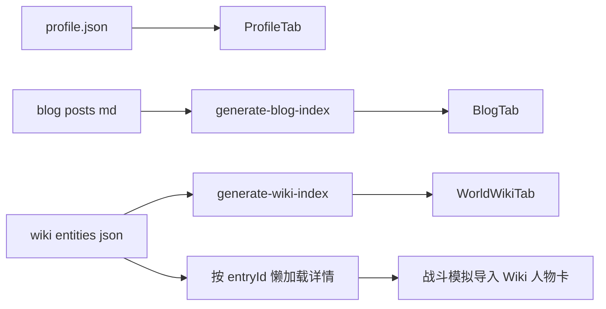
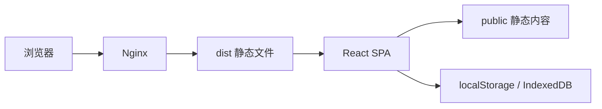

# TRPG Lucius Helper

TRPG Lucius Helper 是一个面向跑团主持与玩家回顾的静态 Web 工具站。它把个人主页、战斗模拟、世界 Wiki、音效键盘、模组线索图和博客战报放在同一个 React SPA 中，主要服务于 CoC / 洛氏风格跑团内容维护与现场辅助。

项目当前是纯前端应用：构建产物部署到 Nginx，运行时数据主要来自 `public/` 下的静态 JSON / Markdown 文件，以及部分浏览器本地存储。

## 功能地图

```text
TRPG Lucius Helper
├─ Tab 1: 个人介绍
│  ├─ Profile 配置展示
│  └─ Live2D 背景
├─ Tab 2: 工具箱
│  ├─ 模拟战斗
│  ├─ 世界 Wiki
│  ├─ 音效键盘
│  └─ 模组工具
└─ Tab 3: 博客杂谈
   ├─ Markdown 文章
   └─ Wiki 战报内嵌渲染
```

| 区域 | 路由 | 说明 |
|------|------|------|
| 个人介绍 | `/` | 个人主页、模组展示、Live2D 背景，数据来自 `public/config/profile.json` |
| 模拟战斗 | `/tools/battle` | CoC 风格战斗 Monte Carlo 模拟，支持预设、Wiki 人物卡和怪物 |
| 世界 Wiki | `/tools/world-wiki` | 人物、地点、事件、书籍、模组、战报等结构化词条 |
| 模组库 | `/tools/world-wiki/modules` | 从 `public/wiki/entities/modules.json` 生成的模组列表和详情 |
| 音效键盘 | `/tools/soundboard` | 键盘触发音效、默认合成音效、自定义音效包 |
| 模组工具 | `/tools/module-clue` | React Flow 线索图与任务图编辑/展示 |
| 博客杂谈 | `/blog` | 静态 Markdown 博客，也可绑定 Wiki 战报词条 |
| Wiki 管理台 | `/admin/wiki` | 仅 dev 环境启用，用于可视化编辑 Wiki JSON |

## 技术栈

- React 19 + TypeScript
- Vite 6
- React Router v7
- Tailwind CSS 4 + shadcn/ui 风格组件
- Framer Motion
- React Flow
- Web Audio API
- PixiJS + pixi-live2d-display

更完整的技术决策见 [docs/tech-decisions.md](docs/tech-decisions.md)。

## 项目结构

```text
src/
├─ App.tsx                         # 路由入口
├─ components/TabLayout.tsx         # 顶部/底部导航、全局布局、备案号
├─ pages/
│  ├─ ProfileTab/                  # 个人主页 + Live2D
│  ├─ ToolboxTab/BattleSimulator/  # 战斗模拟
│  ├─ WorldWikiTab/                # 世界 Wiki 首页与详情
│  ├─ WorldWikiModulesTab.tsx      # 模组列表
│  ├─ ModuleToolTab/               # 线索图工具
│  ├─ SoundboardTab/               # 音效键盘
│  └─ BlogTab/                     # 博客与战报
├─ features/wiki/                  # Wiki 渲染、人物卡、块编辑器
├─ hooks/                          # 音频、键盘、Wiki 读取 hook
├─ stores/                         # localStorage 驱动的工具状态
└─ types/                          # Wiki 等共享类型

public/
├─ config/profile.json             # 个人主页配置
├─ blog/                           # 博客 Markdown 与生成索引
├─ wiki/entities/                  # Wiki 源数据
├─ wiki/index.json                 # 生成后的 Wiki 检索索引
├─ sound-effects/default/          # 默认音效包 manifest
└─ live2d/                         # Live2D 模型资源

scripts/
├─ generate-wiki-index.ts          # Wiki 索引生成与引用校验
├─ generate-blog-index.ts          # 博客索引生成
├─ seed-coc-sheets.ts              # 写入 CoC 人物卡示例数据
├─ wiki-admin-plugin.ts            # dev-only Wiki 写盘插件
└─ trpg-workflow.ps1               # TRPG 文档读取/拆解工作流
```

代码阅读顺序可以参考 [docs/code-reading-guide.md](docs/code-reading-guide.md)。

## 本地开发

要求 Node.js 20+，包管理器使用 pnpm。

```bash
pnpm install
pnpm dev
```

常用命令：

| 命令 | 作用 |
|------|------|
| `pnpm generate:wiki` | 从 `public/wiki/entities/` 生成 `public/wiki/index.json` |
| `pnpm generate:blog` | 从 `public/blog/posts/` 生成 `public/blog/index.json` |
| `pnpm type-check` | TypeScript 类型检查 |
| `pnpm build` | 生成 Wiki/Blog 索引后构建生产产物 |
| `pnpm lint` | ESLint 检查 |
| `pnpm seed:coc-sheets --force` | 为示例人物词条写入/覆盖 CoC 人物卡块 |

`pnpm dev` 和 `pnpm build` 会自动执行 Wiki 与 Blog 索引生成。

AI 对话与 PL token 校验需要同时启动主仓前端和 `trpg-ai-gateway` 子仓服务。本地联调步骤见 [docs/localhost-ai-gateway-debug.md](docs/localhost-ai-gateway-debug.md)。

## 内容维护

### 世界 Wiki

Wiki 源数据位于 `public/wiki/entities/`：

- `players.json`：PL 列表与唯一 key
- `modules.json`：模组库
- `entries/*.json`：人物、地点、事件、书籍、模组入口、战报等词条

维护后运行：

```bash
pnpm generate:wiki
```

Wiki 正文使用结构化 block，核心类型在 `src/types/wiki.ts`。渲染器支持：

- `paragraph` / `heading` / `list` / `quote` / `image`
- `ref` 站内引用
- `secret-panel` 整段隐藏
- `secret-inline` 短语隐藏
- `coc-sheet` CoC 人物卡

规则细节见 [docs/business.md](docs/business.md) 和 [docs/wiki-research-notes.md](docs/wiki-research-notes.md)。  
TRPG 内容与 agent 工作流见 [AGENTS.md](AGENTS.md)、[CLAUDE.md](CLAUDE.md)、[docs/skills/trpg-suite-workflow.md](docs/skills/trpg-suite-workflow.md)。

### 博客与战报

博客源文件在 `public/blog/posts/*.md`。普通文章使用 Markdown；战报可以通过 frontmatter 绑定 Wiki 词条：

```yaml
renderMode: wiki
wikiEntryId: report.xxx
players:
  - pl.xxx
```

维护后运行：

```bash
pnpm generate:blog
```

博客/Wiki 结合方式见 [docs/business.md](docs/business.md)。

## 数据流





## 部署

生产部署通过 GitHub Actions 到腾讯云轻量服务器 Nginx：

- 主应用构建部署：`.github/workflows/deploy.yml`
- 仅静态内容部署：`.github/workflows/deploy-content.yml`

主部署流程：

```text
push master
  -> pnpm install
  -> pnpm build
  -> SCP dist/*
  -> 生成/备份 Nginx 配置
  -> 检测 SSL 证书
  -> reload nginx
```

部署说明见：

- [docs/deploy-guide.md](docs/deploy-guide.md)
- [docs/deploy-https-notes.md](docs/deploy-https-notes.md)

当前站点底部悬挂 ICP 备案号，并链接到工信部备案系统。对应实现位于 `src/components/TabLayout.tsx`。

## 文档索引

| 文档 | 用途 |
|------|------|
| [docs/business.md](docs/business.md) | 功能范围、业务规则、内容结构 |
| [docs/tech-decisions.md](docs/tech-decisions.md) | 技术选型与关键决策 |
| [docs/code-reading-guide.md](docs/code-reading-guide.md) | 新人读代码路径 |
| [docs/deploy-guide.md](docs/deploy-guide.md) | 腾讯云/Nginx 部署基础 |
| [docs/deploy-https-notes.md](docs/deploy-https-notes.md) | GitHub Actions 与 HTTPS 证书处理 |
| [docs/deploy-sealdice-qq.md](docs/deploy-sealdice-qq.md) | 海豹骰 QQ 服务同服务器 Docker 部署与端口/域名规划 |
| [docs/dev-log.md](docs/dev-log.md) | 开发记录 |
| [docs/reports/](docs/reports/) | 阶段调研与专项报告 |
| [docs/skills/trpg-suite-workflow.md](docs/skills/trpg-suite-workflow.md) | TRPG 文档处理工作流 |
| [AGENTS.md](AGENTS.md) | Codex/Agent 项目约束 |
| [CLAUDE.md](CLAUDE.md) | Claude Code 项目约束与 agent 索引 |

## 维护原则

- 用户可见文案优先使用中文。
- 机器可读 key、文件名、代码标识使用英文。
- Wiki 内容不是 GM 备团后台，公开层应保护 PL 沉浸与剧透边界。
- `magic-book` 词条按“书页/残卷/馆藏卡本身”写，不写成站外百科介绍。
- 修改 Wiki 或 Blog 内容后，要重新生成对应索引。
- 避免无关重构；大改前先查现有文档和历史决策。
